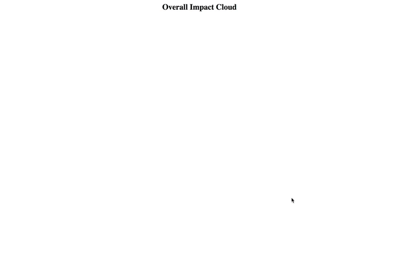

# d3-force-simulation
Overall Impact cloud simulation with D3.js Force Simulated graphs. 
Learn more about Force simulated D3 graphs: https://d3indepth.com/force-layout/

## How to run the demo
2 ways
1. Host the folder inside your own HTTP server and access it. eg. Mamp, Wamp
2. Drag n drop the index.html file in your browser

## Demo Gif

## Authors
**Joseph Khan** - (https://github.com/jsphkhan)

## License
This project is licensed under the MIT License
